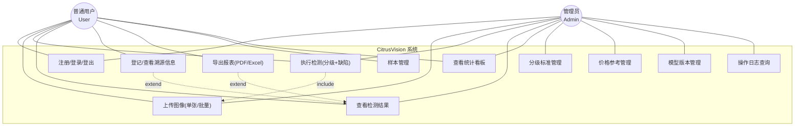
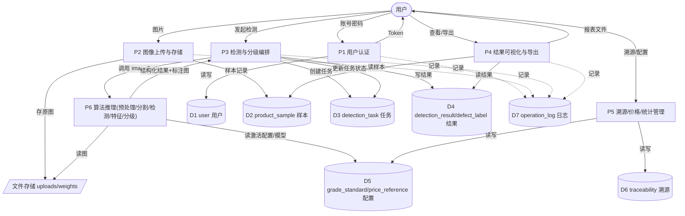

# 需求规格说明书（SRS）

**项目名称**：基于机器视觉的农产品品质分级与缺陷检测系统
**工程代号**：CitrusVision
**文档版本**：v1.0
**编写日期**：2026-06-22
**适用课程**：《软件工程课程设计》（23 本科计科 1 班）
**小组**：第 12 组

| 角色 | 姓名 | 学号 |
|---|---|---|
| 组长（项目经理 + 后端 + 架构） | 陈绍杰 | 2312402060134 |
| 算法负责人 | 黄权达 | 2312402060133 |
| 算法副 + 数据工程 | 张嘉豪 | 2312402060135 |
| 前端 + 测试 + 文档 | 黄浩然 | 2312402060128 |

---

## 1. 引言

### 1.1 编写目的

本文档对 CitrusVision 系统的功能需求与非功能需求进行完整、准确、可验证的描述，作为概要设计、详细设计、编码实现与系统测试的统一依据。读者对象为本项目全体开发成员、指导教师及答辩评委。

### 1.2 项目背景

肇庆（四会、德庆等）是广东重要柑橘产区。传统品质分级依赖人工目检，存在主观性强、标准不一、效率低、缺陷易漏检、可追溯性差等问题。本系统采用机器视觉技术，对柑橘（砂糖橘 / 贡柑）图像进行自动品质分级与表面缺陷检测，并提供溯源与市场价格参考。

### 1.3 项目范围

| 范畴 | 内容 |
|---|---|
| **做（In Scope）** | 单张 / 批量柑橘图像的品质分级（一级 / 二级 / 等外品）、表面缺陷检测与框选（病斑 / 裂纹 / 碰伤 / 畸形）、溯源信息登记、市场价格参考、结果可视化、报表（PDF/Excel）导出 |
| **不做（Out of Scope）** | 产线实时高速分拣硬件；多品类通用模型；内部品质（糖度、内部腐烂）无损检测；真实传感器 / PLC 接入 |

### 1.4 术语与定义

术语对齐项目领域语言文件 [CONTEXT.md](../../CONTEXT.md)，核心术语摘录：

| 术语 | 英文 / 标识 | 含义 |
|---|---|---|
| 品质分级 | Quality Grading | 依果径、着色率、缺陷占比将柑橘分为一级 / 二级 / 等外品 |
| 缺陷检测 | Defect Detection | 识别并定位果面病斑 / 裂纹 / 碰伤 / 畸形 |
| 着色率 | Color Ratio | 果面橙色区域占比（%），表征成熟度与色泽 |
| 果径 | Diameter | 果实直径估计（mm） |
| 缺陷占比 | Defect Ratio | 缺陷面积占果面总面积的百分比（%） |
| 溯源 | Traceability | 产地 / 品种 / 批次 / 检测时间 / 检测人等可追溯数据 |
| ROI | Region of Interest | 从图像分割出的果实区域 |
| 双引擎方案 | — | 传统 CV（可解释分级）+ 深度学习（缺陷检测）混合架构 |
| mAP | Mean Average Precision | 目标检测主要评估指标 |

### 1.5 参考资料

- 《软件工程课程设计》要求及题目（题目 10）
- 第 12 组项目方案文档
- 项目领域上下文 [CONTEXT.md](../../CONTEXT.md)
- 数据库脚本 [database/schema.sql](../../database/schema.sql)

---

## 2. 总体描述

### 2.1 产品定位

CitrusVision 是一套基于 B/S 架构的 Web 应用，面向柑橘产地分拣员、合作社质检员（普通用户）与技术 / 管理人员（管理员），提供"上传即检测、检测即分级、分级有依据、结果可溯源"的一站式品质检测服务。

### 2.2 用户角色

| 角色 | 标识 | 典型人员 | 主要权限 |
|---|---|---|---|
| 普通用户 | `user` | 分拣员、质检员 | 上传检测、查看 / 导出结果、登记溯源 |
| 管理员 | `admin` | 技术员、管理人员 | 普通用户全部权限 + 分级标准 / 价格 / 模型 / 日志管理、统计看板 |

### 2.3 运行环境

| 项 | 要求 |
|---|---|
| 客户端 | Chrome / Edge 现代浏览器；移动端主流手机浏览器（H5） |
| 服务端 | Python 3.10+、Node.js 18+、MySQL 8.0+；可选 Docker / Docker Compose |
| 算力 | CPU 可推理（YOLOv8n）；有 GPU 更佳 |

### 2.4 设计约束

- **可解释性优先**：分级结论必须附带量化指标（果径 / 着色率 / 缺陷占比），不得黑盒。
- **传统兜底**：深度学习效果不佳时，传统 CV 分级链路须独立可用。
- **算法解耦**：算法服务以独立进程 + 内部 HTTP 接口提供，便于模型替换。

### 2.5 假设与依赖

| 编号 | 假设 / 依赖 |
|---|---|
| A1 | 项目开发周期为 4 周（实际以指导老师排期为准）。 |
| A5 | 分级量化标准为本组自拟，阈值可由管理员在"标准管理"模块配置。 |
| A-数据 | 演示数据集规模 300~600 张，每类缺陷 ≥ 80~150 张，来源为公开数据集 + 网络采集 + 自建实拍。 |
| A-算力 | 无 GPU 时使用 Colab / 百度 AI Studio 免费 GPU 训练，本地 CPU 推理。 |

### 2.6 数据准备方案

数据采集与标注是项目的**关键路径与最大进度风险**（W1 即需启动）。本节明确数据来源、工作量与应急预案。

#### 2.6.1 数据来源构成

| 来源 | 数量 | 占比 | 说明 | 负责人 |
|---|---|---|---|---|
| 公开数据集 | ~200 张 | ~40% | Kaggle Citrus Disease Dataset、百度 AI Studio、天池柑橘数据集 | 张嘉豪 |
| 网络采集 | ~200 张 | ~40% | 电商商品图（淘宝/拼多多），需注意版权，仅用于教学演示 | 张嘉豪 |
| 自建实拍 | ~100~200 张 | ~20% | 本地水果店/市场拍摄，控制变量（纯色背景、固定距离、放硬币参照） | 全组周末 |

#### 2.6.2 标注规范

| 项 | 规范 |
|---|---|
| 标注工具 | **Roboflow**（在线协作，自动导出 YOLO 格式）或 **LabelImg**（本地） |
| 缺陷标注 | 矩形框，4 类（black_spot/crack/bruise/deformity），YOLO txt 格式 |
| 分级标注 | 图像级类别标签（按等级分文件夹：grade1/grade2/out） |
| 标注质量 | 双人交叉复核，不一致由算法负责人（黄权达）裁定 |

#### 2.6.3 工作量评估

- 假设 600 张，平均每张 2 个缺陷框 ≈ 1200 个标注框
- 每张约 3~5 分钟（含复核）≈ **30~50 小时纯标注时间**
- **2 人并行**（张嘉豪 + 1 名协助），每人 ~25 小时，W1 周内完成

#### 2.6.4 数据划分与防泄露

- 划分比例：训练 : 验证 : 测试 = **7 : 2 : 1**，分层抽样保证各类均衡
- **防数据泄露**：同一批次/同一果实的多角度照片必须划入**同一子集**，避免训练集与测试集重叠导致虚高指标

#### 2.6.5 应急预案

| 风险 | 应对 |
|---|---|
| 标注延期 | 先用 200 张训练基线模型跑通流程，边训练边补标注 |
| 自建数据不足 | 加大公开数据集占比，自建数据仅用于演示实拍效果 |
| 某类缺陷样本稀缺 | 缺陷类别由 4 类精简为 3 类（病斑/裂纹/损伤），合并碰伤与畸形 |
| 整体数据不足 | 数据增强（旋转/翻转/亮度抖动/Mosaic）扩充 3~5 倍 |

---

## 3. 功能需求

功能需求编号 FR1–FR14，优先级 **P0**（MVP 必做）/ **P1**（加分）/ **P2**（扩展）。

| 编号 | 功能 | 描述 | 输入 | 输出 | 优先级 | 验收点 |
|---|---|---|---|---|---|---|
| FR1 | 用户与权限 | 注册 / 登录 / 登出，区分管理员与普通用户 | 账号、密码 | Token、用户信息、角色 | P0 | 未登录访问受保护接口返回 401 |
| FR2 | 图像上传 | PC 拖拽上传 + 移动端 H5 拍照；单张与批量（≥10 张） | 图片文件（JPG/PNG ≤10MB） | 样本记录、图片 URL | P0 | 批量 10 张全部入库；非图片被拒 |
| FR3 | 图像预处理 | 尺寸归一化、去噪、白平衡校正、ROI 提取（果实分割 / 背景剔除） | 原图 | 预处理图、果实掩膜 | P0 | 果实区域正确分离背景 |
| FR4 | 品质分级 | 计算果径、着色率、缺陷占比，按标准评一级 / 二级 / 等外品 | 预处理图 + 缺陷结果 | 等级 + 量化指标 | P0 | 分级附量化依据 |
| FR5 | 缺陷检测 | YOLOv8 定位框选病斑 / 裂纹 / 碰伤 / 畸形，输出类别与置信度 | 预处理图 | 缺陷框列表（类别 + bbox + 置信度） | P0 | 明显缺陷被框出 |
| FR6 | 结果可视化 | 标注图、量化指标卡、等级徽章、批量结果列表与统计图 | 检测结果 | 可视化页面 / 图 | P0 | 缺陷框醒目、等级一目了然 |
| FR7 | 溯源信息 | 录入 / 展示产地、品种、批次、检测时间、检测人，生成溯源二维码 | 溯源表单 | 溯源记录、二维码图片 | P1 | 扫码可查溯源信息 |
| FR8 | 价格参考 | 按等级映射市场参考价（管理员可维护） | 等级 | 参考价（元/斤） | P1 | 各等级显示对应价格 |
| FR9 | 报表导出 | 单条 / 批量导出 PDF、Excel | 结果集 | 报告文件 | P1 | PDF 含等级 / 指标 / 二维码 |
| FR10 | 样本管理 | 样本入库、检索、删除；标注数据管理 | 操作请求 | 列表 / 详情 | P1 | 可分页检索与删除 |
| FR11 | 模型管理 | 管理员登记模型版本、激活 / 切换、查看评估指标 | 模型元数据 | 当前激活模型 | P2 | 切换后推理使用新模型 |
| FR12 | 标准管理 | 管理员维护分级阈值 | 阈值表单 | 生效标准 | P1 | 阈值修改后分级随之变化 |
| FR13 | 日志管理 | 记录关键操作与检测记录，支持查询 | 行为事件 | 日志列表 | P1 | 登录 / 上传 / 检测 / 导出有日志 |
| FR14 | 统计看板 | 检测总量、各等级占比、缺陷类型分布 | — | 统计图表 | P1 | 看板数据与库内一致 |

### 3.1 MVP 范围

登录 → 单 / 批量上传 → 预处理 → 缺陷检测（框选）→ 品质分级（等级 + 指标）→ 结果可视化 → 检测记录入库 → 基础统计看板。即 FR1–FR6 + FR14 基础部分。

---

## 4. 非功能需求

### 4.1 性能需求

| 指标 | 目标值 |
|---|---|
| 单张检测响应时间（冷启动） | ≤ 5 秒（CPU，含模型加载）/ ≤ 2 秒（GPU） |
| 单张检测响应时间（后续） | ≤ 3 秒（CPU）/ ≤ 1 秒（GPU） |
| 批量检测（10 张） | ≤ 30 秒（后续） |
| 并发支持 | 演示级 ≥ 5 并发不崩溃 |
| 图片格式 / 大小 | JPG / PNG，单张 ≤ 10MB |

### 4.2 算法质量需求

| 指标 | 目标值 |
|---|---|
| 缺陷检测 mAP@0.5 | ≥ 0.60（演示级目标） |
| 分级与人工标注一致率 | ≥ 80%（演示集） |

### 4.3 其他非功能需求

| 类别 | 要求 |
|---|---|
| 可用性 | 界面中文、核心操作 ≤ 3 步、移动端友好 |
| 可维护性 | 分级标准可配置、模型可热切换、四层解耦 |
| 可追溯性 | 每次检测记录入库，可查询、可导出 |
| 可演示性 | 缺陷框选醒目、等级一目了然、支持实拍演示 + 兜底预录 |
| 安全性 | 密码 bcrypt 哈希存储、JWT 鉴权、管理员接口角色校验 |

---

## 5. 用例模型

### 5.1 用例图

> 说明：`UC3 执行检测` include `UC2 上传图像`（检测必先上传）；`UC6 导出报表`、`UC5 溯源登记` 为 `UC4 查看结果` 的扩展用例。

### 5.2 核心用例详细描述

#### UC2 + UC3：上传并检测（核心用例）

| 项 | 内容 |
|---|---|
| 用例编号 | UC-DETECT |
| 参与者 | 普通用户、管理员 |
| 前置条件 | 已登录且 Token 有效 |
| 触发 | 用户在检测页选择图片并点击"开始检测" |
| 主成功流程 | 1. 用户选择 1~N 张图片（JPG/PNG ≤10MB） 2. 系统校验格式与大小，存储原图，创建 `product_sample` 记录 3. 系统创建 `detection_task`（状态 processing） 4. 后端调用算法服务 `/infer` 5. 算法服务预处理 → 果实分割 → YOLOv8 缺陷检测 → 特征计算 → 规则分级 6. 算法返回结构化结果 + 标注图 7. 后端写入 `detection_result` 与 `defect_label`，关联参考价 / 溯源 8. 任务状态置 done，前端渲染标注图 + 等级徽章 + 指标 + 缺陷列表 |
| 备选流程 | 2a. 非图片 / 超大 → 提示并拒绝 4a. 算法服务超时 / 异常 → 传统 CV 兜底分级；仍失败则任务置 failed 并记录 `error_msg` |
| 后置条件 | 检测结果入库、可查询、可导出 |

#### UC5：溯源登记

| 项 | 内容 |
|---|---|
| 参与者 | 普通用户、管理员 |
| 前置条件 | 存在目标样本，且已登录 |
| 主流程 | 1. 用户在结果页打开溯源登记 2. 录入产地 / 品种 / 生产者 / 批次 / 检测人 3. 系统保存 `traceability`（与样本一对一）并生成二维码 4. 展示溯源信息与二维码，可扫码访问 |
| 业务规则 | 一个样本仅一条溯源记录（`sample_id` UNIQUE） |

#### UC9：分级标准管理（管理员）

| 项 | 内容 |
|---|---|
| 参与者 | 管理员 |
| 前置条件 | 以管理员身份登录 |
| 主流程 | 1. 查看分级标准列表（`grade_standard`） 2. 编辑阈值（最小果径、着色率阈值 1/2、缺陷占比阈值 1/2） 3. 保存并激活某标准（同一时刻仅一个 `is_active=1`） 4. 后续检测按新激活标准分级 |
| 业务规则 | 阈值默认值见 [database/seed.sql](../../database/seed.sql)：砂糖橘标准 着色率 85/70、缺陷占比 2/5、最小果径 45mm |

#### UC11：模型版本管理（管理员）

| 项 | 内容 |
|---|---|
| 参与者 | 管理员 |
| 主流程 | 1. 查看模型列表（版本、算法、mAP/P/R） 2. 选择某版本激活（`is_active=1` 唯一） 3. 算法服务后续推理加载激活模型权重 |

---

## 6. 数据流图（DFD 第 1 层）

---

## 7. 数据字典

数据存储（D1–D7）对应 [database/schema.sql](../../database/schema.sql) 的 10 张表，字段级定义见详细设计说明书与 schema.sql 中文注释。此处给出数据项、数据流、数据存储的字典条目。

### 7.1 数据项（核心字段）

| 数据项 | 标识 | 类型 | 取值 / 约束 |
|---|---|---|---|
| 用户角色 | role | ENUM | admin / user |
| 任务类型 | type | ENUM | single / batch |
| 任务状态 | status | ENUM | pending / processing / done / failed |
| 评定等级 | grade | ENUM | grade1（一级）/ grade2（二级）/ out（等外品） |
| 缺陷类型 | defect_type | ENUM | black_spot / crack / bruise / deformity |
| 着色率 | color_ratio | DECIMAL(5,2) | 0~100（%） |
| 果径 | diameter_mm | DECIMAL(6,2) | 毫米 |
| 缺陷占比 | defect_ratio | DECIMAL(5,2) | 0~100（%） |
| 置信度 | confidence | DECIMAL(4,3) | 0~1 |

### 7.2 数据流

| 数据流 | 来源 → 去向 | 组成 |
|---|---|---|
| 登录请求 | 用户 → P1 | username + password |
| 鉴权令牌 | P1 → 用户 | token + role + userInfo |
| 上传图片 | 用户 → P2 | 图片文件 + origin + batch_no |
| 推理请求 | P3 → P6 | imagePath + standardId |
| 推理结果 | P6 → P3 | grade + diameter_mm + color_ratio + defect_ratio + defects[] + annotatedPath + confidence |
| 检测结果展示 | P4 → 用户 | grade + indicators + defects + annotatedUrl |
| 报表文件 | P4 → 用户 | PDF / Excel 文件流 |

### 7.3 数据存储

| 编号 | 数据存储 | 对应表 | 关键内容 |
|---|---|---|---|
| D1 | 用户 | user | 账号、密码哈希、角色、状态 |
| D2 | 样本 | product_sample | 图片路径、产地、批次、上传人、尺寸 |
| D3 | 任务 | detection_task | 任务编号、发起人、模型、类型、状态、计数 |
| D4 | 结果 | detection_result, defect_label | 等级、量化指标、缺陷框、参考价、复核 |
| D5 | 配置 | grade_standard, price_reference, model_info | 分级阈值、参考价、模型版本与指标 |
| D6 | 溯源 | traceability | 产地、品种、生产者、批次、二维码路径 |
| D7 | 日志 | operation_log | 操作人、动作、对象、IP、时间 |

---

## 8. 需求优先级与里程碑映射

| 优先级 | 功能 | 对应里程碑 |
|---|---|---|
| P0（MVP） | FR1–FR6、FR14 基础 | M3 MVP 闭环可用 |
| P1（加分） | FR7–FR10、FR12–FR14 | M3 / M4 |
| P2（扩展） | FR11、人工复核闭环、多品类对照 | M4 视余力 |

里程碑定义与排期见 [docs/TODO.md](../TODO.md)。

---

## 9. 需求确认

| 待确认项 | 说明 | 责任人 |
|---|---|---|
| 实际开发周期 | A1 假设 4 周，以指导老师排期为准 | 陈绍杰 |
| 分级量化标准 | A5 自拟，可在标准管理模块调整 | 张嘉豪 |
| 数据集来源合规 | 网络采集需注意版权 | 张嘉豪 |

---

**文档结束** · CitrusVision 需求规格说明书 v1.0
