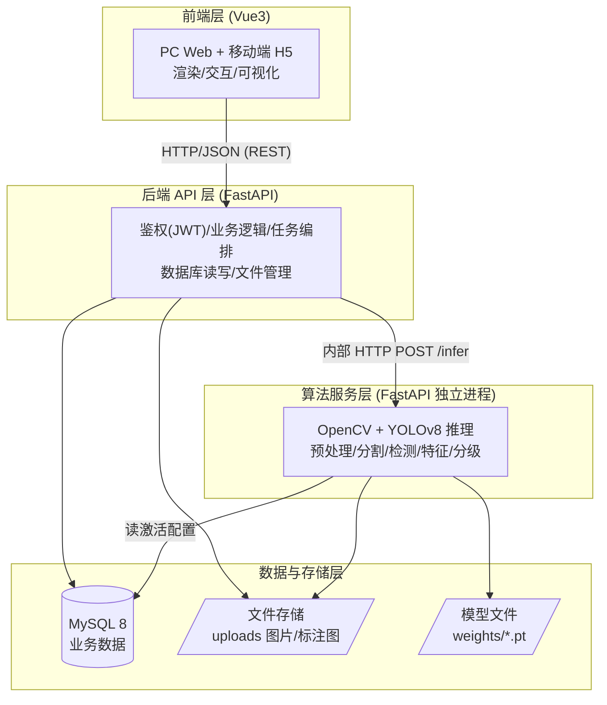
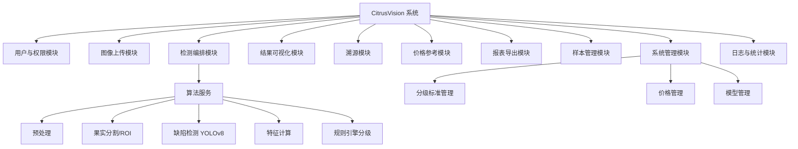
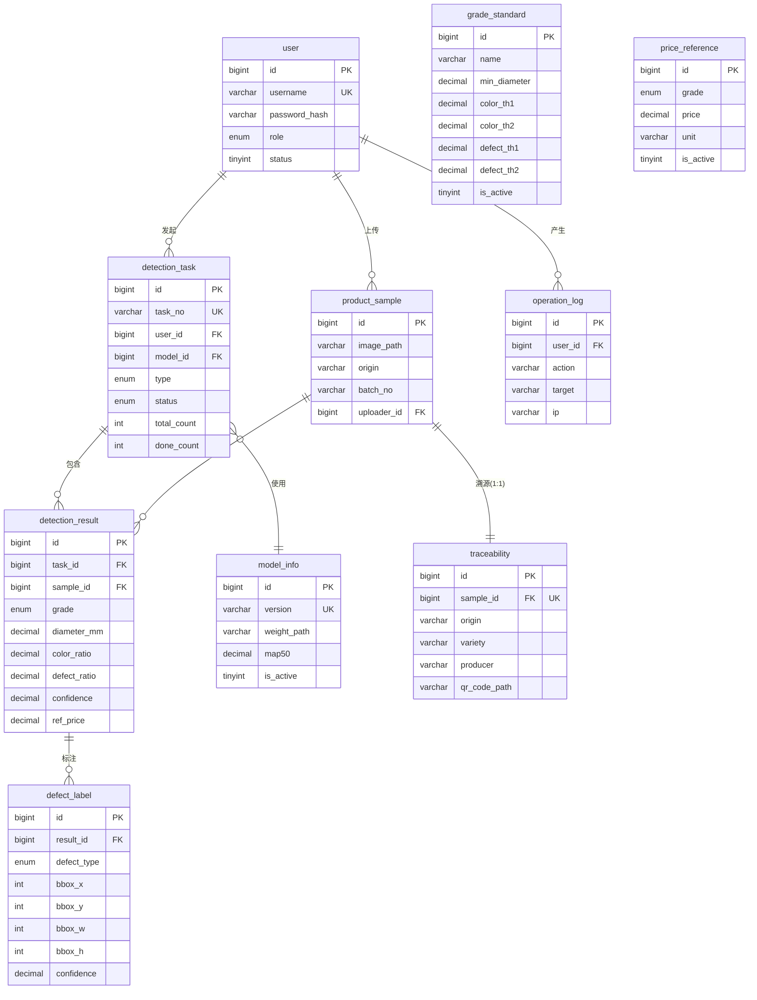
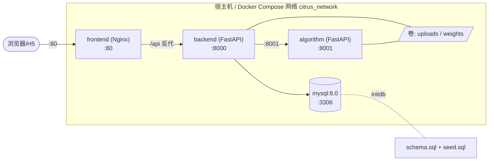
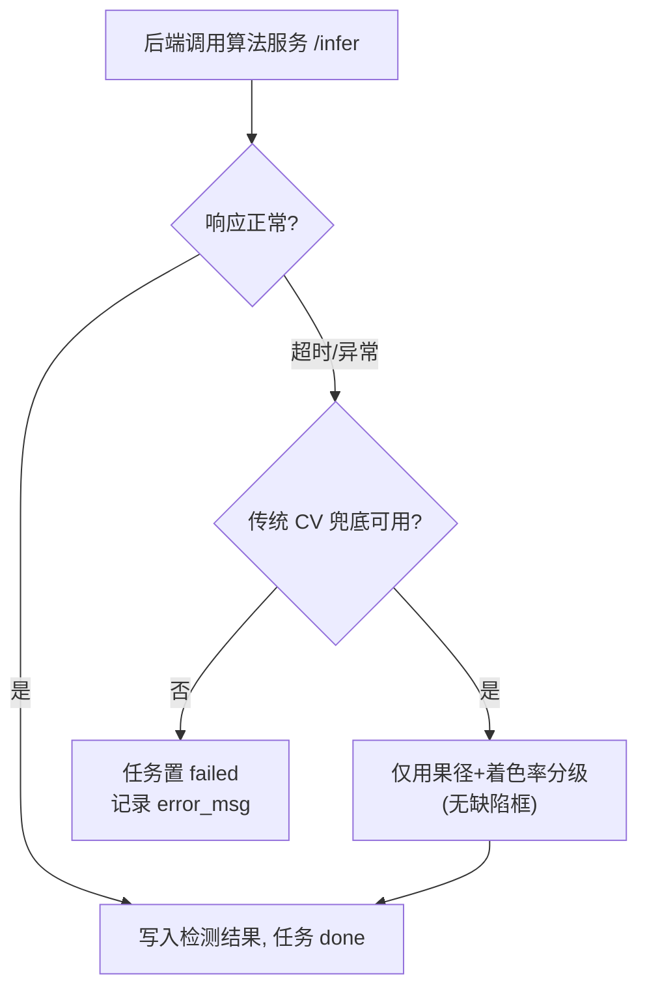

# 概要设计说明书

**项目名称**：基于机器视觉的农产品品质分级与缺陷检测系统
**工程代号**：CitrusVision
**文档版本**：v1.0
**编写日期**：2026-06-22
**小组**：第 12 组（陈绍杰 2312402060134 · 黄权达 2312402060133 · 张嘉豪 2312402060135 · 黄浩然 2312402060128）

---

## 1. 引言

### 1.1 编写目的

本文档基于《需求规格说明书》，从体系结构、模块划分、数据库设计、接口设计与出错处理五方面给出系统的概要设计，作为详细设计与编码的总体框架。

### 1.2 设计原则

- **分层解耦**：前端 / 后端 API / 算法服务 / 数据库四层分离，各层可独立开发、测试、替换。
- **契约先行**：接口契约（§5）先于实现确定，前后端 + 算法并行开发。
- **可解释 + 可兜底**：分级附量化指标；DL 不可用时传统 CV 链路独立运行。
- **配置外置**：分级阈值、参考价、激活模型存于数据库，可在线调整。

---

## 2. 体系结构设计

### 2.1 总体架构（四层 B/S + 文件存储）



### 2.2 各层职责

| 层 | 职责 | 关键技术 | 不做 |
|---|---|---|---|
| 前端层 | 页面渲染、用户交互、结果可视化（Canvas 缺陷框、ECharts 图表）、调用 REST API | Vue 3 + Vite + Element Plus + Pinia + Vue Router + ECharts + Axios | 不直接访问数据库或算法 |
| 后端 API 层 | JWT 鉴权、业务逻辑、任务编排、DB 读写、文件管理、报表生成 | FastAPI + Uvicorn + SQLAlchemy + Pydantic | **不直接做推理**，经内部 HTTP 调算法服务 |
| 算法服务层 | 加载模型、提供 `/infer`，输入图片返回结构化结果 + 标注图 | OpenCV + PyTorch + Ultralytics YOLOv8 + scikit-learn | 不做鉴权 / 业务（仅纯计算） |
| 数据与存储层 | MySQL 存业务数据；本地文件存图片 / 标注图 / 模型权重 | MySQL 8（生产）/ SQLite（开发） | — |

### 2.3 解耦理由

算法服务独立成进程，使**模型可替换**（换 weights 即可）、**算力可隔离**（算法服务可单独部署到 GPU 机器）、**故障可降级**（算法服务挂掉时后端走传统 CV 兜底，业务不全断）。

### 2.4 技术选型依据

| 选型 | 依据 |
|---|---|
| FastAPI | 自带 Swagger，直接服务接口设计交付；异步性能好 |
| YOLOv8n | CPU 可推理，适合无 GPU 演示环境 |
| Vue 3 + Element Plus | 学习曲线平、组件丰富、出活快 |
| MySQL 8 | 契合课设"数据库设计"要求，便于画 E-R 图 |
| 双引擎混合 | 传统 CV 可解释 + DL 高精度，双保险 |

---

## 3. 模块结构设计

### 3.1 软件结构图



### 3.2 模块清单与职责

| 模块 | 职责 | 输入 | 输出 | 优先级 |
|---|---|---|---|---|
| 用户与权限 | 注册 / 登录 / 角色 / 会话 | 账号密码 | Token、用户信息 | P0 |
| 图像上传 | 单 / 批量上传、H5 拍照、格式校验、存储 | 图片文件 | 样本记录、URL | P0 |
| 检测编排 | 创建任务、调算法服务、写结果、状态流转 | 样本 ID | 任务、结果 | P0 |
| 结果可视化 | 绘标注图、指标卡、统计图 | 检测结果 | 可视化页面 | P0 |
| 溯源 | 录入 / 展示溯源、生成二维码 | 表单 | 溯源记录、二维码 | P1 |
| 价格参考 | 等级 → 参考价映射 | 等级 | 参考价 | P1 |
| 报表导出 | 生成 PDF / Excel | 结果集 | 报告文件 | P1 |
| 样本管理 | 样本 / 标注数据 CRUD | 操作请求 | 列表 / 详情 | P1 |
| 系统管理 | 标准 / 价格 / 模型管理 | 配置请求 | 生效配置 | P1/P2 |
| 日志与统计 | 操作日志、统计看板 | 行为事件 | 日志、图表 | P1 |

---

## 4. 数据库概要设计

### 4.1 E-R 图



### 4.2 表清单

完整字段定义见 [database/schema.sql](../../database/schema.sql)（每字段含中文 COMMENT）。10 张表概览：

| 序号 | 表名 | 说明 | 关键外键 |
|---|---|---|---|
| 1 | user | 用户表 | — |
| 2 | product_sample | 样本表 | uploader_id → user |
| 3 | detection_task | 检测任务表 | user_id → user, model_id → model_info |
| 4 | detection_result | 检测结果表 | task_id → detection_task, sample_id → product_sample |
| 5 | defect_label | 缺陷标签表 | result_id → detection_result |
| 6 | grade_standard | 分级标准表 | — |
| 7 | price_reference | 价格参考表 | — |
| 8 | traceability | 溯源信息表 | sample_id → product_sample（1:1） |
| 9 | model_info | 模型信息表 | — |
| 10 | operation_log | 操作日志表 | user_id → user |

### 4.3 ⚠️ 建表顺序说明

`detection_task`（表 3）的外键引用 `model_info`（表 9）。**直接顺序执行 schema.sql 会因 `model_info` 尚未创建而外键失败**。处理方式（任选其一）：

1. **调整建表顺序**：将 `model_info` 提前到 `detection_task` 之前创建（推荐）。
2. **临时关闭外键检查**：脚本首尾加 `SET FOREIGN_KEY_CHECKS=0; ... SET FOREIGN_KEY_CHECKS=1;`。
3. **Docker initdb**：docker-compose 以 `01-schema.sql` 顺序自动执行，需实测验证一次。

> 建议在编码阶段采用方式 1 永久修正 schema.sql。

### 4.4 初始数据

初始化数据见 [database/seed.sql](../../database/seed.sql)：
- 用户：admin / demo_user（密码由后端 bcrypt 生成）
- 分级标准：砂糖橘（激活，min_diameter=45、着色 85/70、缺陷 2/5）、贡柑（备用）
- 价格：grade1=8.50、grade2=5.00、out=2.00 元/斤
- 模型：v1.0-yolov8n-baseline（map50=0.62，激活）

---

## 5. 接口设计总览

### 5.1 接口约定

- **基础前缀**：`/api/v1`
- **数据格式**：JSON（上传用 multipart/form-data）
- **鉴权**：除注册 / 登录外，请求头携带 `Authorization: Bearer <token>`；管理员接口额外校验角色。
- **统一返回包**：

```json
{ "code": 0, "msg": "ok", "data": { } }
```

### 5.2 错误码表

| code | 含义 | HTTP 状态 |
|---|---|---|
| 0 | 成功 | 200 |
| 400 | 请求参数错误 | 400 |
| 401 | 未认证 / Token 失效 | 401 |
| 403 | 无权限（非管理员访问管理接口） | 403 |
| 404 | 资源不存在 | 404 |
| 500 | 服务器内部错误 | 500 |

### 5.3 REST 接口清单

| 接口 | 方法 | 鉴权 | 说明 |
|---|---|---|---|
| /auth/register | POST | 否 | 注册 |
| /auth/login | POST | 否 | 登录，返回 token |
| /auth/logout | POST | 是 | 登出 |
| /samples | POST | 是 | 上传样本（单 / 批量） |
| /samples | GET | 是 | 样本分页列表 |
| /samples/{id} | GET / DELETE | 是 | 样本详情 / 删除 |
| /tasks | POST | 是 | 创建检测任务 |
| /tasks/{id} | GET | 是 | 任务详情 / 进度 |
| /tasks | GET | 是 | 任务分页列表 |
| /results/{taskId} | GET | 是 | 任务结果列表 |
| /results/{id} | GET | 是 | 单条结果详情 |
| /results/{id}/correct | PUT | 是 | 人工复核（扩展） |
| /trace/{sampleId} | GET / POST | 是 | 溯源查看 / 登记 |
| /reports/{taskId}/export | GET | 是 | 导出 PDF / Excel |
| /prices | GET / PUT | GET 是 / PUT 管理员 | 价格表 |
| /standards | GET / PUT | GET 是 / PUT 管理员 | 分级标准 |
| /models · /models/{id}/activate | GET / PUT | 管理员 | 模型列表 / 激活 |
| /stats/overview | GET | 是 | 统计看板数据 |
| /logs | GET | 管理员 | 操作日志查询 |

### 5.4 算法服务内部接口

| 接口 | 方法 | 请求 | 响应 |
|---|---|---|---|
| /infer | POST | `{ imagePath, standardId }` | `{ grade, diameter_mm, color_ratio, defect_ratio, defect_count, defects:[{type,bbox,conf}], annotatedPath, confidence }` |

逐字段定义见详细设计说明书 §5。

---

## 6. 部署拓扑



端口约定与服务编排见 [docker-compose.yml](../../docker-compose.yml)：前端 80、后端 8000、算法 8001、MySQL 3306。

> **待补文件**：三个服务的 `Dockerfile` 与 `deploy/nginx.conf` 当前尚未创建，部署前需补齐（其内容规范见用户手册 §部署）。

---

## 7. 出错处理与降级设计



| 场景 | 处理策略 |
|---|---|
| 上传非图片 / 超大 | 后端校验拒绝，返回 400 + 友好提示 |
| 未登录访问受保护接口 | 返回 401 |
| 非管理员访问管理接口 | 返回 403 |
| 算法服务超时 / 异常 | 降级为传统 CV 分级兜底；仍失败则任务 failed |
| 数据库写入失败 | 事务回滚，任务标记 failed |
| 演示现场故障 | 本地离线演示 + 预录视频双保险 |

---

## 8. 设计到需求的追溯

| 需求 | 承载模块 | 接口 |
|---|---|---|
| FR1 | 用户与权限 | /auth/* |
| FR2 | 图像上传 | /samples |
| FR3–FR5 | 检测编排 + 算法服务 | /tasks、/infer |
| FR6、FR14 | 结果可视化、统计 | /results/*、/stats/overview |
| FR7 | 溯源 | /trace/* |
| FR8、FR12 | 价格、标准管理 | /prices、/standards |
| FR9 | 报表导出 | /reports/*/export |
| FR10 | 样本管理 | /samples |
| FR11 | 模型管理 | /models |
| FR13 | 日志 | /logs |

---

**文档结束** · CitrusVision 概要设计说明书 v1.0
