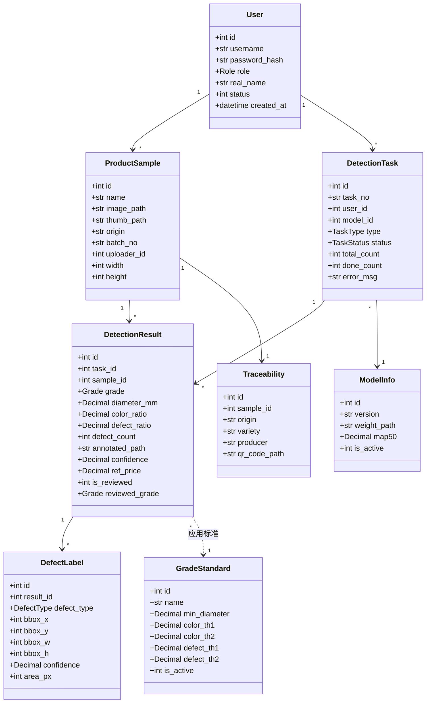
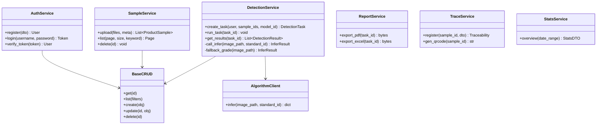
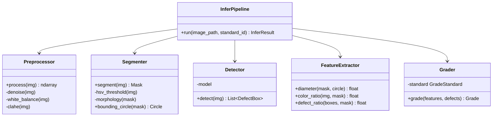
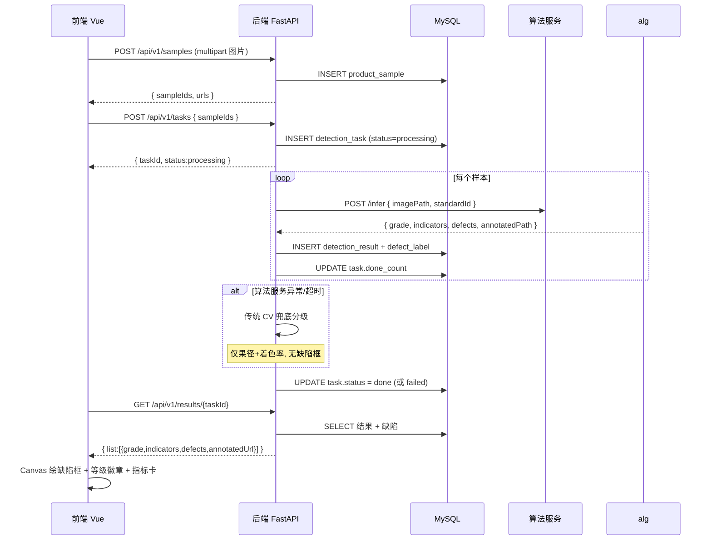
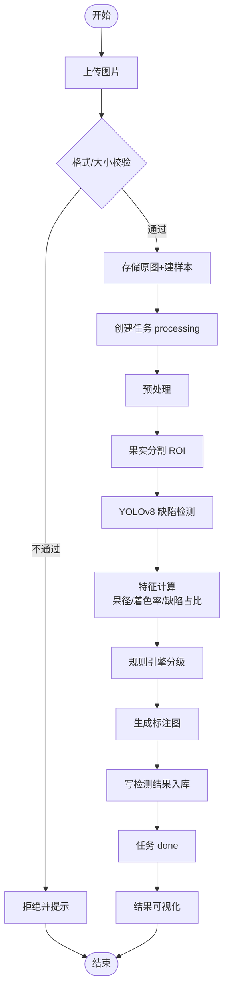
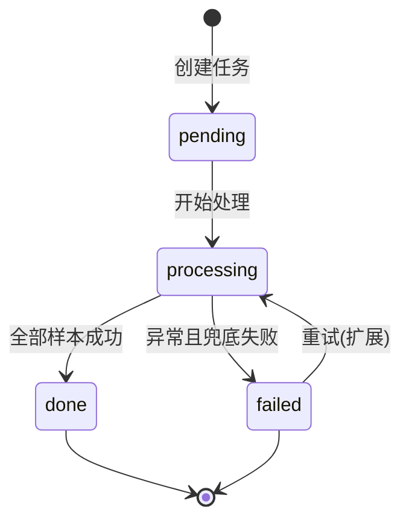
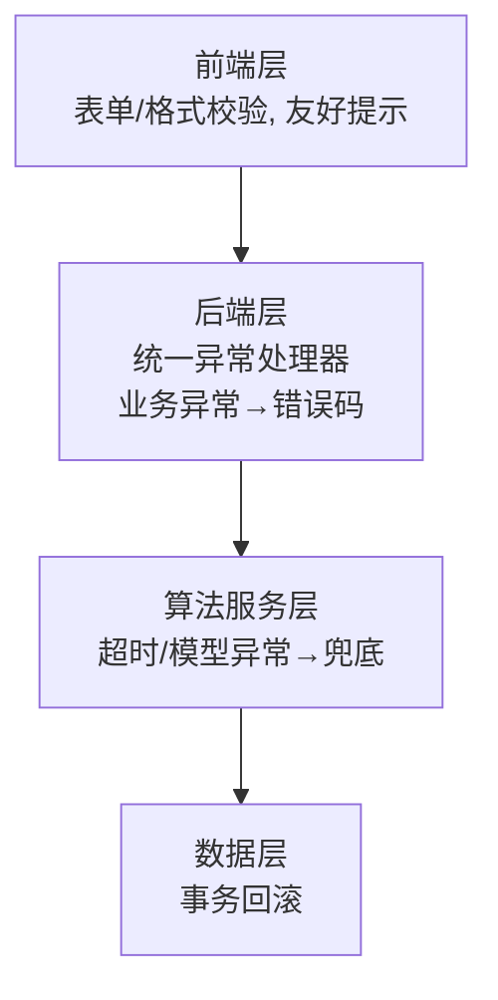

# 详细设计说明书

**项目名称**：基于机器视觉的农产品品质分级与缺陷检测系统
**工程代号**：CitrusVision
**文档版本**：v1.0
**编写日期**：2026-06-22
**小组**：第 12 组（陈绍杰 2312402060134 · 黄权达 2312402060133 · 张嘉豪 2312402060135 · 黄浩然 2312402060128）

---

## 1. 引言

本文档在概要设计基础上，对各模块给出可直接编码的详细设计，包括类设计、关键流程（时序 / 活动 / 状态）、接口逐字段定义、数据结构、算法步骤与异常处理策略。

代码组织约定见《源代码文档》；本文重点是**设计**：开发者据此可直接写出函数签名与核心逻辑。

---

## 2. 类设计

### 2.1 后端 ORM 模型与分层

后端采用 **三层分层**：`API 路由 → Service（业务） → CRUD（数据访问） → ORM Model（SQLAlchemy）`。



### 2.2 Service / CRUD 分层



### 2.3 算法服务 Pipeline 类



---

## 3. 核心流程设计

### 3.1 时序图：单张检测全链路



### 3.2 活动图：检测业务流程



### 3.3 状态图：detection_task 状态机



| 状态 | 含义 | 进入条件 | 退出条件 |
|---|---|---|---|
| pending | 已创建未开始 | POST /tasks | 开始处理 |
| processing | 处理中 | 调用算法服务 | 全部完成 / 失败 |
| done | 已完成 | done_count == total_count | — |
| failed | 失败 | 算法异常且兜底失败 / DB 错误 | 重试（扩展） |

---

## 4. 接口详细定义（REST）

所有接口前缀 `/api/v1`，统一返回包 `{ code, msg, data }`，鉴权见概要设计 §5.1。下表给出请求 / 响应字段级定义。

### 4.1 认证

#### POST /auth/register

| 项 | 内容 |
|---|---|
| 鉴权 | 无 |
| 请求体 | `{ username: str, password: str, real_name?: str }` |
| 响应 data | `{ id: int, username: str }` |
| 错误 | 400 用户名已存在 / 参数不合法 |

#### POST /auth/login

| 项 | 内容 |
|---|---|
| 鉴权 | 无 |
| 请求体 | `{ username: str, password: str }` |
| 响应 data | `{ token: str, role: "admin"\|"user", userInfo: {id, username, real_name} }` |
| 错误 | 401 用户名或密码错误 |

#### POST /auth/logout

| 项 | 内容 |
|---|---|
| 鉴权 | 是 |
| 响应 data | `null` |

### 4.2 样本

#### POST /samples（上传）

| 项 | 内容 |
|---|---|
| 鉴权 | 是 |
| 请求 | `multipart/form-data`：`files`（单 / 多文件）+ `origin?`、`batch_no?` |
| 校验 | 格式 JPG/PNG，单张 ≤ 10MB |
| 响应 data | `{ sampleIds: int[], urls: str[] }` |
| 错误 | 400 非图片 / 超大 |

#### GET /samples

| 项 | 内容 |
|---|---|
| 查询参数 | `page=1, size=10, keyword?` |
| 响应 data | `{ total: int, list: SampleDTO[] }` |

#### GET /samples/{id} · DELETE /samples/{id}

| 项 | 内容 |
|---|---|
| 响应 data | GET：`SampleDTO`；DELETE：`null` |
| 错误 | 404 样本不存在 |

### 4.3 任务

#### POST /tasks

| 项 | 内容 |
|---|---|
| 请求体 | `{ sampleIds: int[], modelId?: int }` |
| 行为 | 创建任务（single / batch 由数量判定），异步 / 同步执行检测 |
| 响应 data | `{ taskId: int, status: "processing" }` |

#### GET /tasks/{id}

| 项 | 内容 |
|---|---|
| 响应 data | `{ task: TaskDTO, progress: { total, done, percent } }` |

#### GET /tasks

| 项 | 内容 |
|---|---|
| 查询参数 | `page, size, status?` |
| 响应 data | `{ total, list: TaskDTO[] }` |

### 4.4 结果

#### GET /results/{taskId}

| 项 | 内容 |
|---|---|
| 响应 data | `{ list: ResultDTO[] }`，ResultDTO 含 `grade, indicators{diameter_mm,color_ratio,defect_ratio}, defects[], annotatedUrl, ref_price` |

#### GET /results/{id}

| 项 | 内容 |
|---|---|
| 响应 data | 单条 `ResultDTO` 详情 |

#### PUT /results/{id}/correct（人工复核，扩展）

| 项 | 内容 |
|---|---|
| 请求体 | `{ grade: Grade, defects?: DefectDTO[] }` |
| 行为 | 置 `is_reviewed=1`、写 `reviewed_grade` |

### 4.5 溯源

#### GET /trace/{sampleId} · POST /trace/{sampleId}

| 项 | 内容 |
|---|---|
| POST 请求体 | `{ origin, variety, producer, batch_no, detect_time, inspector }` |
| 响应 data | `{ trace: TraceDTO, qrUrl: str }` |
| 业务规则 | 一个样本仅一条溯源（sample_id UNIQUE），重复登记为更新 |

### 4.6 报表

#### GET /reports/{taskId}/export

| 项 | 内容 |
|---|---|
| 查询参数 | `format=pdf\|excel` |
| 响应 | 文件流（`application/pdf` 或 `application/vnd.openxmlformats...`） |
| 内容 | 等级、量化指标、缺陷列表、溯源二维码 |

### 4.7 管理接口（管理员）

| 接口 | 方法 | 请求 / 响应 |
|---|---|---|
| /prices | GET / PUT | GET → 价格列表；PUT `{ grade, price }` |
| /standards | GET / PUT | GET → 标准列表；PUT 阈值字段；激活唯一 |
| /models | GET | 模型列表（version, algorithm, map50, is_active） |
| /models/{id}/activate | PUT | 激活指定模型（唯一） |
| /logs | GET | `page, size, action?` → 日志列表 |

### 4.8 统计

#### GET /stats/overview

| 项 | 内容 |
|---|---|
| 查询参数 | `dateRange?` |
| 响应 data | `{ total: int, gradeDist: {grade1, grade2, out}, defectDist: {black_spot, crack, bruise, deformity} }` |

### 4.9 算法服务内部接口

#### POST /infer

| 项 | 内容 |
|---|---|
| 请求体 | `{ imagePath: str, standardId: int }` |
| 响应 | 见下方数据结构 `InferResult` |
| 超时 | 后端设超时（如 10s），超时触发兜底 |

---

## 5. 数据结构定义

### 5.1 枚举

```python
Role        = "admin" | "user"
TaskType    = "single" | "batch"
TaskStatus  = "pending" | "processing" | "done" | "failed"
Grade       = "grade1" | "grade2" | "out"
DefectType  = "black_spot" | "crack" | "bruise" | "deformity"
```

### 5.2 Pydantic Schema（后端，示意字段）

```python
class SampleDTO:
    id: int
    name: str | None
    image_url: str
    thumb_url: str | None
    origin: str | None
    batch_no: str | None
    width: int | None
    height: int | None
    created_at: datetime

class DefectDTO:
    type: DefectType
    bbox: tuple[int, int, int, int]   # x, y, w, h
    confidence: float                  # 0~1

class ResultDTO:
    id: int
    grade: Grade
    indicators: dict     # { diameter_mm, color_ratio, defect_ratio }
    defect_count: int
    defects: list[DefectDTO]
    annotated_url: str
    confidence: float
    ref_price: float | None
    is_reviewed: bool
    is_fallback: bool    # 是否为降级模式（算法服务不可用时）

class TaskDTO:
    id: int
    task_no: str
    type: TaskType
    status: TaskStatus
    total_count: int
    done_count: int
    created_at: datetime
```

### 5.3 算法服务 InferResult

```python
class InferResult:
    grade: Grade
    diameter_mm: float
    color_ratio: float       # 0~100
    defect_ratio: float      # 0~100
    defect_count: int
    defects: list[DefectDTO]
    annotated_path: str
    confidence: float        # 0~1 综合置信度
    is_fallback: bool        # 是否为降级模式
```

### 5.4 前端 TS 类型（对齐后端 DTO，示意）

```typescript
type Grade = 'grade1' | 'grade2' | 'out'
interface Defect { type: string; bbox: [number, number, number, number]; confidence: number }
interface DetectionResult {
  id: number
  grade: Grade
  indicators: { diameter_mm: number; color_ratio: number; defect_ratio: number }
  defects: Defect[]
  annotatedUrl: string
  refPrice?: number
}
interface ApiResponse<T> { code: number; msg: string; data: T }
```

---

## 6. 算法详细设计

总路线：**传统 CV 做分级 + 深度学习做缺陷检测**，双引擎、可解释、可兜底。流水线 5 阶段：

```
原图 → ①预处理 → ②果实分割/ROI → ③缺陷检测(YOLOv8) → ④特征计算 → ⑤分级评定 → 结果
```

### 6.1 阶段定义

| 阶段 | 输入 | 处理 | 输出 | 关键参数 |
|---|---|---|---|---|
| ①预处理 | 原图 | 缩放归一化、高斯去噪、灰度世界白平衡、（可选）CLAHE 对比增强 | 预处理图 | resize 目标尺寸；CLAHE clipLimit |
| ②果实分割 | 预处理图 | HSV 阈值 + 形态学开闭运算分离果实与背景，求外接圆 | 果实掩膜、外接圆 | HSV 橙色区间；形态学核大小 |
| ③缺陷检测 | 预处理图 | YOLOv8n/s 推理，输出框 + 类别 + 置信度 | 缺陷框列表 | CONF_THRESHOLD=0.25、IOU=0.45 |
| ④特征计算 | 掩膜 + 缺陷框 | 果径（外接圆像素 → mm）、着色率（橙色像素占比）、缺陷占比（缺陷面积 ÷ 果面） | 三项量化指标 | 像素 → mm 换算系数 |
| ⑤分级评定 | 指标 + 缺陷 | 规则引擎按激活标准判级 | 等级 + 综合置信度 | 见 §6.2 阈值 |

### 6.2 分级规则引擎（伪代码）

阈值取自激活的 `grade_standard`（默认砂糖橘：着色率 85/70、缺陷占比 2/5、最小果径 45mm，见 [database/seed.sql](../../database/seed.sql)）。

```python
def grade(features, defects, std):
    color   = features.color_ratio      # %
    defect  = features.defect_ratio     # %
    diam    = features.diameter_mm
    has_crack = any(d.type == "crack" for d in defects)
    has_severe_deform = any(d.type == "deformity" and d.area_px_large for d in defects)

    # 一级（精品）
    if (diam >= std.min_diameter and color >= std.color_th1
            and defect < std.defect_th1 and not has_crack):
        return "grade1"
    # 二级（合格）
    if (color >= std.color_th2 and defect < std.defect_th2
            and not has_crack and not has_severe_deform):
        return "grade2"
    # 等外品
    return "out"
```

### 6.3 传统 CV 兜底

当 YOLOv8 不可用（模型缺失 / 算法服务异常）时，系统进入**降级模式**：

- **缺陷检测**：返回空数组，`defect_count=0`，`defect_ratio=0`
- **分级规则简化**：移除 `has_crack` 和 `has_severe_deform` 判断，仅用果径 + 着色率分级
- **最高等级限制**：降级模式最高给**二级**（不给一级），避免误判劣质果为精品
- **明确标注**：返回结果增加 `is_fallback: true`，前端显示"降级模式：未检测缺陷，建议人工复核"

降级分级规则伪代码：
```python
def grade_fallback(features, std):
    color = features.color_ratio
    diam  = features.diameter_mm
    # 降级模式：最高给二级
    if diam >= std.min_diameter and color >= std.color_th1:
        return "grade2"  # 原本一级条件，降级为二级
    elif color >= std.color_th2:
        return "grade2"
    else:
        return "out"
```

保证在算法服务异常时，分级链路仍可用且不误导用户。

### 6.4 评估方法

| 任务 | 指标 | 目标 |
|---|---|---|
| 缺陷检测 | mAP@0.5、Precision、Recall、各类 AP、PR 曲线 | mAP@0.5 ≥ 0.60 |
| 品质分级 | 准确率、混淆矩阵、人工一致率 | 一致率 ≥ 80% |

数据划分 训练:验证:测试 = 7:2:1；增强：旋转、翻转、亮度 / 对比度抖动、加噪、Mosaic（扩 3~5 倍）。

---

## 7. 异常处理策略

### 7.1 分层异常处理



| 层 | 异常 | 处理 |
|---|---|---|
| 前端 | 选错文件、网络断 | 前端校验 + Axios 拦截器统一弹窗 |
| 前端鉴权 | 收到 401 响应 | Axios 拦截器捕获 → 清除本地 token → 跳转登录页 + 提示"登录已过期，请重新登录" |
| 后端业务 | 参数错、资源不存在、无权限 | 抛业务异常 → 全局处理器 → `{code, msg}` |
| 后端鉴权 | Token 失效 / 缺失 | 返回 401；非管理员访问管理接口返回 403 |
| 算法服务 | 推理超时、模型加载失败 | 后端捕获 → 传统 CV 兜底；记录日志 |
| 数据层 | 写入失败 | SQLAlchemy 事务回滚，任务置 failed |

**JWT Token 说明**：
- Token 有效期：24 小时（`JWT_EXPIRE_MINUTES=1440`）
- 无 refresh token 机制（课设简化设计，演示期间不会过期）
- 前端需在 Axios 响应拦截器中全局处理 401，避免每个请求单独处理

### 7.2 统一异常响应

后端注册 FastAPI 全局 `exception_handler`，将业务异常、校验异常、未捕获异常统一转为 `{ code, msg, data:null }`，并写 `operation_log`（关键操作）。

### 7.3 关键异常清单

| 异常 | 错误码 | 提示 |
|---|---|---|
| 用户名已存在 | 400 | "用户名已被注册" |
| 密码错误 | 401 | "用户名或密码错误" |
| Token 失效 | 401 | "登录已过期，请重新登录" |
| 非管理员操作 | 403 | "无操作权限" |
| 样本 / 任务不存在 | 404 | "资源不存在" |
| 上传非图片 | 400 | "仅支持 JPG/PNG 图片" |
| 算法服务不可用 | 500 / 降级 | "已使用传统算法分级" |

---

## 8. 文件上传安全设计

图像上传是系统的核心入口，需要防范安全风险并确保存储可管理性。

### 8.1 安全威胁与防护

| 威胁 | 攻击方式 | 防护措施 |
|---|---|---|
| **文件类型伪装** | 修改扩展名将恶意文件(.exe)伪装为图片 | 验证文件头 magic bytes（`filetype` 库），不仅检查扩展名 |
| **路径遍历攻击** | 提交 `../../etc/passwd` 作为文件名 | 使用 `secure_filename()` 过滤特殊字符，禁止路径分隔符 |
| **文件名冲突** | 多用户同时上传 `orange.jpg` | UUID + 时间戳重命名：`{uuid4()}_{timestamp}.{ext}` |
| **磁盘空间耗尽** | 恶意上传大量图片 | 单用户配额限制（可选）+ 定期清理未关联样本的孤立文件 |
| **超大文件 DoS** | 上传接近 10MB 的图片耗尽内存 | FastAPI `UploadFile` 流式读取，分块写入，不全载入内存 |

### 8.2 文件存储设计

```python
# 存储路径分层设计
uploads/
  ├── 2026-06-22/                    # 按日期分层，避免单目录文件过多
  │   ├── a3f2b1c4_1719043200.jpg   # {uuid}_{timestamp}.{ext}
  │   └── thumbs/                    # 缩略图子目录
  │       └── a3f2b1c4_1719043200_thumb.jpg
  └── 2026-06-23/
```

**关键实现要点**：
- **文件重命名**：`new_filename = f"{uuid.uuid4().hex[:8]}_{int(time.time())}.{ext}"`
- **相对路径存储**：数据库仅存 `2026-06-22/xxx.jpg`，不存绝对路径，便于迁移
- **缩略图异步生成**：上传后立即返回，后台用 Pillow 生成 200x200 缩略图，失败不影响主流程
- **原图保留**：不覆盖，便于重新生成缩略图或标注图

### 8.3 上传流程伪代码

```python
async def upload_sample(file: UploadFile, origin: str, batch_no: str, user_id: int):
    # 1. 校验文件大小（FastAPI 自动限制 10MB）
    # 2. 验证文件头
    header = await file.read(16)
    await file.seek(0)
    if not is_valid_image(header):  # 检查 JPEG/PNG magic bytes
        raise HTTPException(400, "仅支持 JPG/PNG 图片")
    
    # 3. 生成安全文件名
    ext = secure_filename(file.filename).rsplit('.', 1)[-1].lower()
    new_name = f"{uuid.uuid4().hex[:8]}_{int(time.time())}.{ext}"
    date_dir = datetime.now().strftime("%Y-%m-%d")
    rel_path = f"{date_dir}/{new_name}"
    abs_path = UPLOAD_DIR / rel_path
    
    # 4. 分块写入（流式，不占内存）
    abs_path.parent.mkdir(parents=True, exist_ok=True)
    async with aiofiles.open(abs_path, 'wb') as f:
        while chunk := await file.read(8192):
            await f.write(chunk)
    
    # 5. 获取图像尺寸
    with Image.open(abs_path) as img:
        width, height = img.size
    
    # 6. 入库
    sample = ProductSample(
        name=None,  # 品种后续人工标注或识别
        image_path=rel_path,
        thumb_path=None,  # 异步生成
        origin=origin,
        batch_no=batch_no,
        uploader_id=user_id,
        file_size=abs_path.stat().st_size,
        width=width,
        height=height
    )
    db.add(sample)
    db.commit()
    
    # 7. 后台异步生成缩略图（Celery/BackgroundTasks）
    generate_thumbnail.delay(sample.id, abs_path)
    
    return sample
```

### 8.4 缩略图生成（后台任务）

```python
def generate_thumbnail(sample_id: int, image_path: Path):
    try:
        thumb_dir = image_path.parent / "thumbs"
        thumb_dir.mkdir(exist_ok=True)
        thumb_path = thumb_dir / f"{image_path.stem}_thumb{image_path.suffix}"
        
        with Image.open(image_path) as img:
            img.thumbnail((200, 200))
            img.save(thumb_path, quality=85)
        
        # 更新数据库
        db.query(ProductSample).filter_by(id=sample_id).update({
            "thumb_path": str(thumb_path.relative_to(UPLOAD_DIR))
        })
        db.commit()
    except Exception as e:
        logger.error(f"缩略图生成失败 sample_id={sample_id}: {e}")
        # 失败不阻塞，前端展示原图即可
```

### 8.5 存储清理策略（可选）

定期任务（cron）扫描 `uploads/` 目录，删除：
- 超过 30 天且未被 `product_sample` 引用的孤立文件
- 失败任务关联的图片（`detection_task.status='failed'` 且超过 7 天）

---

## 9. 模块详细设计到接口的追溯

| 模块 | 主要类 | 接口 |
|---|---|---|
| 用户与权限 | AuthService | /auth/* |
| 图像上传 | SampleService | /samples |
| 检测编排 | DetectionService、AlgorithmClient | /tasks、/infer |
| 算法 | InferPipeline + 5 阶段类 | /infer |
| 结果可视化 | （前端 DefectCanvas、GradeBadge） | /results/* |
| 溯源 | TraceService | /trace/* |
| 报表 | ReportService | /reports/*/export |
| 统计 | StatsService | /stats/overview |

---

**文档结束** · CitrusVision 详细设计说明书 v1.0
