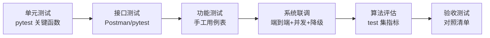

# 测试报告

**项目名称**：基于机器视觉的农产品品质分级与缺陷检测系统
**工程代号**：CitrusVision
**文档版本**：v1.0
**编写日期**：2026-06-22
**小组**：第 12 组（陈绍杰 2312402060134 · 黄权达 2312402060133 · 张嘉豪 2312402060135 · 黄浩然 2312402060128）
**主要负责人**：黄浩然（测试 + 文档）

---

## 1. 引言

### 1.1 编写目的

本报告描述 CitrusVision 系统的测试策略、测试用例、测试结果与验收对照，验证系统满足《需求规格说明书》定义的功能与非功能需求。

### 1.2 测试范围

| 类别 | 范围 |
|---|---|
| 功能测试 | FR1–FR14 各功能点（手工 + 用例表） |
| 接口测试 | 全部 REST API + 算法 `/infer`（Postman/Apifox + pytest） |
| 算法评估 | 缺陷检测 mAP / P / R；分级准确率 / 一致率 |
| 系统联调 | 端到端全链路 + 并发 5 + 降级 |
| 兼容性测试 | Chrome / Edge / 移动端 H5 |
| 验收测试 | 按《需求规格说明书》§4 与项目验收标准逐项核验 |

### 1.3 测试环境

| 项 | 配置 |
|---|---|
| 后端 / 算法 | Python 3.10、FastAPI、CPU 推理 |
| 数据库 | MySQL 8.0 |
| 前端 | Chrome / Edge 最新版；测试机型若干 H5 |
| 工具 | Postman / Apifox（接口）、pytest（自动化）、JMeter / locust（并发，可选） |

---

## 2. 测试策略

- **契约驱动**：接口测试以详细设计 §4 的字段定义为基准，校验返回结构与错误码。
- **算法独立评估**：用预留 test 集（占 10%）跑 `evaluate.py`，产出 mAP / 混淆矩阵 / PR 曲线。
- **降级验证**：手动停掉算法服务，验证后端传统 CV 兜底分级仍可用。

---

## 3. 功能测试用例

### 3.1 典型用例（核心）

| 编号 | 用例 | 前置 | 步骤 | 预期结果 | 优先级 |
|---|---|---|---|---|---|
| TC-01 | 上传非图片被拒 | 已登录 | 上传 .txt / .exe 文件 | 拒绝并提示"仅支持 JPG/PNG"，返回 400 | P0 |
| TC-02 | 裂纹果判等外 | 已登录、有裂纹样本 | 上传含明显裂纹的柑橘图检测 | 等级 = 等外品，且裂纹被框出 | P0 |
| TC-03 | 批量 10 张统计 | 已登录 | 一次上传 10 张并检测 | 10 张全返回，统计看板各等级计数正确 | P0 |
| TC-04 | 未登录访问受保护接口 | 未登录 | 直接调用 /api/v1/tasks | 返回 401 | P0 |
| TC-05 | PDF 含二维码 | 已检测 + 已登记溯源 | 导出 PDF | PDF 含等级、量化指标、溯源二维码 | P1 |

### 3.2 功能用例全集

| 编号 | 功能(FR) | 用例 | 预期 |
|---|---|---|---|
| TC-06 | FR1 | 正确账号密码登录 | 返回 token + role |
| TC-07 | FR1 | 错误密码登录 | 返回 401 |
| TC-08 | FR1 | 重复用户名注册 | 返回 400 |
| TC-09 | FR2 | 单张 JPG 上传 | 入库，返回 URL |
| TC-10 | FR2 | 超过 10MB 图片 | 拒绝，返回 400 |
| TC-11 | FR3 | 复杂背景图分割 | 果实正确分离背景 |
| TC-12 | FR4 | 优质果检测 | 等级 = 一级，附果径/着色率/缺陷占比 |
| TC-13 | FR5 | 多缺陷果检测 | 每个缺陷框 + 类别 + 置信度 |
| TC-14 | FR6 | 结果可视化 | 标注图 + 等级徽章 + 指标卡渲染正常 |
| TC-15 | FR7 | 溯源登记 + 扫码 | 二维码可扫，显示溯源信息 |
| TC-16 | FR8 | 价格映射 | 各等级显示对应参考价 |
| TC-17 | FR9 | Excel 导出 | Excel 含结果明细 |
| TC-18 | FR10 | 样本分页检索 | 按关键词分页返回 |
| TC-19 | FR11 | 管理员切换模型 | 切换后推理用新模型 |
| TC-20 | FR12 | 修改分级阈值 | 阈值改后分级结果随之变化 |
| TC-21 | FR13 | 操作日志查询 | 登录/上传/检测/导出有日志 |
| TC-22 | FR14 | 统计看板 | 总量/等级占比/缺陷分布与库内一致 |

### 3.3 边界与异常用例

| 编号 | 场景 | 预期 |
|---|---|---|
| TC-23 | 上传 0 字节 / 损坏图片 | 拒绝并提示 |
| TC-24 | 批量上传含 1 张非图片 | 该张被拒，其余正常 |
| TC-25 | 普通用户访问管理接口 | 返回 403 |
| TC-26 | 算法服务停机后检测 | 传统 CV 兜底分级，任务 done（无缺陷框） |
| TC-27 | 算法 + 兜底都失败 | 任务 failed，记录 error_msg |
| TC-28 | 并发 5 个检测任务 | 全部完成，无崩溃，无数据错乱 |

---

## 4. 接口测试

### 4.1 方法

- **Postman/Apifox**：建立集合，覆盖每个接口的正常 + 异常入参；用环境变量管理 token。
- **pytest**：编写自动化用例，断言 HTTP 状态、`code`、`data` 结构。

### 4.2 接口测试要点

| 接口 | 正常用例 | 异常用例 |
|---|---|---|
| POST /auth/login | 正确凭据 → token | 错密码 → 401 |
| POST /samples | 合法图片 → sampleIds | 非图片 → 400 |
| POST /tasks | 合法 sampleIds → taskId | 空 sampleIds → 400 |
| GET /tasks/{id} | 存在 → 进度 | 不存在 → 404 |
| GET /results/{taskId} | 完成任务 → 结果列表 | 无权限他人任务 → 403 |
| PUT /standards | 管理员 → 更新 | 普通用户 → 403 |
| GET /stats/overview | → 统计结构 | 未登录 → 401 |

### 4.3 返回结构校验

所有接口断言返回符合 `{ code, msg, data }`；成功 `code=0`；错误码符合错误码表（400/401/403/404/500）。

---

## 5. 算法评估

### 5.1 缺陷检测评估

| 指标 | 方法 | 目标值 |
|---|---|---|
| mAP@0.5 | test 集跑 `evaluate.py`（Ultralytics val） | ≥ 0.60 |
| Precision / Recall | 同上 | 报告记录 |
| 各类 AP | black_spot / crack / bruise / deformity 分类统计 | 报告记录 |
| PR 曲线 | matplotlib 绘制 | 附图 |

### 5.2 品质分级评估

| 指标 | 方法 | 目标值 |
|---|---|---|
| 准确率 | 分级结果 vs 人工标注 | — |
| 混淆矩阵 | 一级/二级/等外 三类 | 附图 |
| 人工一致率 | 演示集人工复核一致比例 | ≥ 80% |

### 5.3 评估结果记录表（待实测填写）

| 模型版本 | mAP@0.5 | Precision | Recall | 分级一致率 |
|---|---|---|---|---|
| v1.0-yolov8n-baseline | _（实测）_ | _（实测）_ | _（实测）_ | _（实测）_ |

> 基线参考值见 [database/seed.sql](../../database/seed.sql)：map50≈0.62、precision≈0.71、recall≈0.65（占位，需实测覆盖）。

---

## 6. 性能与兼容性测试

### 6.1 性能测试

| 项 | 目标 | 方法 |
|---|---|---|
| 单张检测响应 | ≤ 3s（CPU） | 计时 20 次取均值 |
| 批量 10 张 | ≤ 30s | 计时 |
| 并发 | ≥ 5 不崩 | JMeter/locust 模拟 |

### 6.2 兼容性测试

| 环境 | 验证点 |
|---|---|
| Chrome / Edge | 页面布局、上传、可视化、导出正常 |
| 移动端 H5 | 拍照上传、响应式布局、结果查看 |

---

## 7. 验收对照表

| 序号 | 验收项 | 标准 | 结果 |
|---|---|---|---|
| 1 | 系统可运行 | 一键 / 文档化启动，登录正常 | _（待测）_ |
| 2 | MVP 闭环 | 上传→预处理→检测→分级→可视化→入库→统计无致命 bug | _（待测）_ |
| 3 | 算法达演示级 | mAP@0.5 ≥ 0.6 或清晰可演示；分级一致率 ≥ 80% | _（待测）_ |
| 4 | 加分功能 | 溯源+二维码、价格参考、PDF/Excel 至少全部可演示 | _（待测）_ |
| 5 | 文档齐全 | 需求/概要/详细/测试/手册/源代码文档规范 | _（待测）_ |
| 6 | 交付物完整 | 报告+视频(≤50M)+源码包+源代码文档，命名规范 | _（待测）_ |
| 7 | 代码规范 | 业务逻辑有注释，结构清晰，可复现 | _（待测）_ |

---

## 8. 缺陷跟踪表（模板）

| 编号 | 模块 | 严重级 | 描述 | 复现步骤 | 状态 | 负责人 |
|---|---|---|---|---|---|---|
| BUG-001 | _ | 高/中/低 | _ | _ | 待修复/已修复/已验证 | _ |

严重级定义：高（阻塞核心流程）/ 中（功能不完整）/ 低（体验问题）。

---

## 9. 测试结论（待测试完成后填写）

| 维度 | 结论 |
|---|---|
| 功能完整性 | _（待填）_ |
| 算法达标 | _（待填）_ |
| 性能 | _（待填）_ |
| 整体可交付 | _（待填）_ |

---

**文档结束** · CitrusVision 测试报告 v1.0
